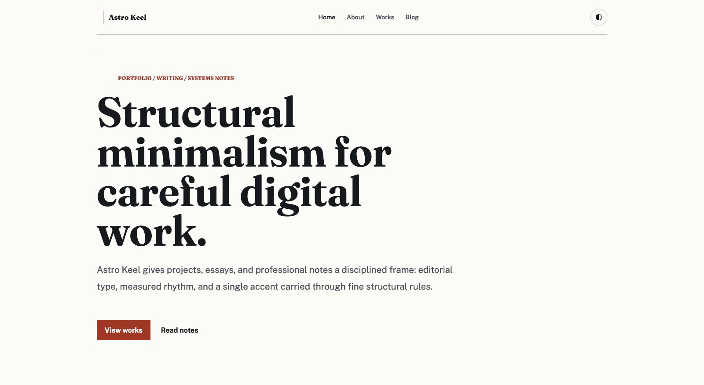
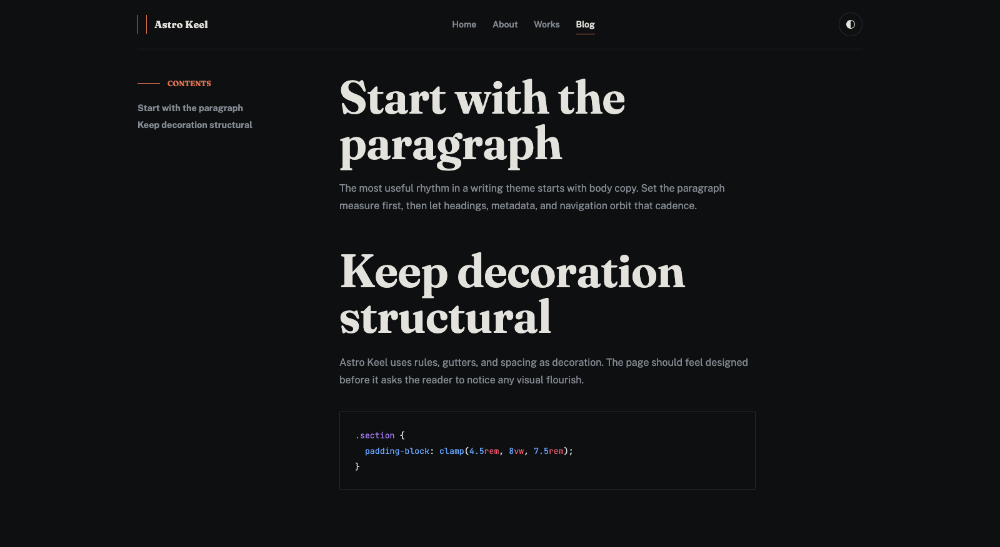
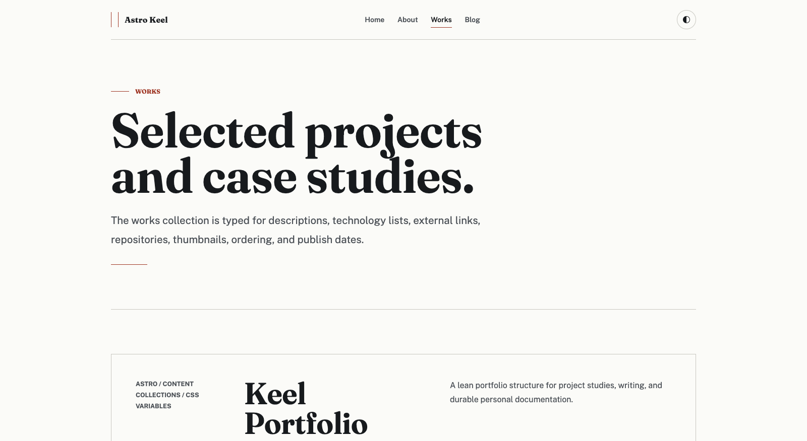

<div align="center">

# ⌁ Astro Keel

**A minimal, neutral, and modern portfolio + blog theme for Astro.**

A calm neutral base, a single configurable accent color, generous whitespace, and clean editorial typography — built on Astro 7 with Content Collections, tags, an RSS feed, and first-class dark mode.

<br />

[](https://kpab.github.io/astro-keel/)

<br />

[](https://github.com/kpab/astro-keel/actions/workflows/deploy.yml)
[](./LICENSE)
[](https://github.com/kpab/astro-keel/stargazers)
<br />
[](https://astro.build)
[](https://www.typescriptlang.org)
[](https://nodejs.org)
[](https://mdxjs.com)

<br />

<picture>
  <source media="(prefers-color-scheme: dark)" srcset=".github/assets/preview-dark.png" />
  
</picture>

<table>
  <tr>
    <td></td>
    <td></td>
  </tr>
</table>

</div>

> **Keel** — the structural backbone of a ship. The name reflects the design intent: stripped of ornament, all structure and spine.

## Features

- **Portfolio + blog** — dedicated `works` and `blog` content collections with individual pages.
- **One-file site config** — site name, description, nav, and footer live in `src/consts.ts`.
- **One-line accent color** — retune the whole theme by changing a single CSS variable (`--color-accent`).
- **Light + dark mode** — respects `prefers-color-scheme` and remembers a manual toggle (no flash on load).
- **Self-hosted type** — Fraunces (display), Public Sans (body), and JetBrains Mono (code) via `@fontsource`, no external font CDN.
- **Tags** — per-tag archive pages at `/blog/tags/[tag]`.
- **Pagination** — blog and tag archives paginate every 10 posts with hairline prev/next links.
- **Static search** — zero-backend full-text search at `/search` powered by [Pagefind](https://pagefind.app/), indexed at build time.
- **Auto OG images** — per-post and per-work Open Graph images rendered at build time with `satori` + `sharp`.
- **Table of contents** — blog posts get an auto-generated sidebar TOC from their headings.
- **RSS feed** — generated at `/rss.xml` with `@astrojs/rss`.
- **Syntax highlighting** — Shiki dual themes (light/dark) wired to the active color scheme.
- **SEO-ready** — canonical URLs, Open Graph, Twitter cards, and a sitemap out of the box.
- **Responsive & accessible** — fluid type, hairline structure, visible focus rings.
- **One-click deploy** — bundled GitHub Pages workflow; or ship the static `dist/` to Cloudflare Pages, Vercel, Netlify, or any static host.

## Tech stack

Astro 7 · TypeScript · Content Collections (Content Layer API) · MDX · `@astrojs/sitemap` · `@astrojs/rss` · Shiki. Requires **Node.js 22+**.

## Quick start

Scaffold a new project directly from this template:

```sh
npm create astro@latest -- --template kpab/astro-keel
```

Or click **Use this template** on GitHub, then:

```sh
npm install
npm run dev      # start the dev server at http://localhost:4321
npm run build    # build the static site to ./dist
npm run preview  # preview the production build
```

## Configuration

### Site identity

Site name, default meta description, RSS description, share image, nav items, and footer text all live in one file — `src/consts.ts`:

```ts
export const SITE = {
  title: 'Astro Keel',
  description: 'A minimal, neutral, and modern portfolio and blog theme for Astro.',
  // ...
};
```

### Site URL

Set your deployed URL in `astro.config.mjs` — it powers canonical links, the sitemap, and RSS:

```js
export default defineConfig({
  site: 'https://your-domain.com',
  // ...
});
```

### Base path

Internal links and assets are routed through a `withBase()` helper (`src/lib/url.ts`), so the theme works whether it's served from a domain root or a subpath. Serving from a subpath — like a GitHub Pages **project site** at `https://<user>.github.io/<repo>/` — just needs `site` + `base`:

```js
export default defineConfig({
  site: 'https://<user>.github.io',
  base: '/<repo>',
});
```

For a custom domain or a `<user>.github.io` **root site**, omit `base` (or set it to `'/'`).

## Customization

### Accent color

Change one line in `src/styles/global.css`. Hover and soft variants derive automatically:

```css
:root {
  --color-accent: oklch(0.54 0.14 35); /* ← your brand color */
}
```

### Fonts

Font families are CSS variables (`--font-display`, `--font-body`, `--font-mono`) in `src/styles/global.css`. Swap a face by installing another `@fontsource` package, importing it in `src/layouts/BaseLayout.astro`, and updating the variable.

### Dark mode

Neutral palettes for both schemes live in `src/styles/global.css` under `:root`, `[data-theme='light']`, and `[data-theme='dark']`. The toggle in the header persists the choice to `localStorage`.

## Authoring content

Add Markdown/MDX files under `src/content/`:

- `src/content/works/*.md` — portfolio entries
- `src/content/blog/*.md` — blog posts

### Works frontmatter

```yaml
---
title: Project name
description: One-line summary.
tech: ["Astro", "TypeScript"]
link: https://example.com        # optional — live link
repo: https://github.com/...     # optional — source
thumbnail: ./cover.png           # optional — relative image
order: 1                         # optional — manual sort
publishDate: 2026-06-01
---
```

### Blog frontmatter

```yaml
---
title: Post title
publishDate: 2026-06-01
description: One-line summary for listings, SEO, and RSS.
tags: ["design", "astro"]
draft: false                     # true hides it from build output
heroImage: ./hero.png            # optional — relative image
---
```

## Project structure

```
src/
  consts.ts          # site name, description, nav, footer
  content/           # works/ and blog/ Markdown & MDX entries
  content.config.ts  # collection schemas (Content Layer API)
  layouts/           # BaseLayout (head, nav, theme toggle)
  pages/             # routes: /, /about, /works, /blog, tags, rss.xml
  styles/            # global.css design tokens
astro.config.mjs     # site URL, integrations, Shiki config
```

## Deployment

### GitHub Pages

A workflow at `.github/workflows/deploy.yml` builds the site and publishes it on every push to `main`.

1. Set `site` and `base` in `astro.config.mjs` to match your repository (see [Base path](#base-path)).
2. In the repository, go to **Settings → Pages** and set **Source** to **GitHub Actions**.
3. Push to `main` (or run the workflow manually from the **Actions** tab). Your site goes live at `https://<user>.github.io/<repo>/`.

### Other static hosts

`npm run build` emits a static `dist/` that deploys as-is to Cloudflare Pages, Vercel, Netlify, or any static host. Drop `base` from `astro.config.mjs` when serving from a domain root.

## License

[MIT](./LICENSE)
